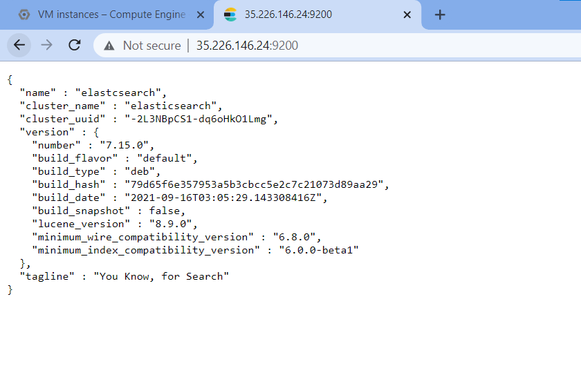

## Java Installtion and Path Setup :

```bash 
#!/bin/bash
# Shell script for installing Java in Ubuntu EC2 instance

# Command for installing Java 11
sudo apt-get update
sudo apt install openjdk-8-jdk openjdk-8-jre -y
sudo cat >> /etc/environment <<EOL
JAVA_HOME=/usr/lib/jvm/java-8-openjdk-amd64
JRE_HOME=/usr/lib/jvm/java-8-openjdk-amd64/jre
EOL

# cat | sudo tee -a /etc/environment <<EOL
# JAVA_HOME=/usr/lib/jvm/java-8-openjdk-amd64
# JRE_HOME=/usr/lib/jvm/java-8-openjdk-amd64/jre
# EOL

```

# elasticsearch Instation 
```bash
#!/bin/bash
sudo apt-get update -y
sudo apt-get install openjdk-11-jdk wget apt-transport-https curl gnupg2 -y
wget -qO - https://artifacts.elastic.co/GPG-KEY-elasticsearch | apt-key add - 
echo "deb https://artifacts.elastic.co/packages/7.x/apt stable main" | tee -a /etc/apt/sources.list.d/elastic-7.x.list
apt-get update -y
apt-get install elasticsearch -y
systemctl start elasticsearch
systemctl enable elasticsearch 
ss -antpl | grep 9200
# curl -X GET http://localhost:9200
```
# Configuration elasticsearch sigle or mutiple cluster

```
root user  

cd /etc/elasticsearch 
vi elasticsearch.yml
```
# Yml file 
```yml
# ======================== Elasticsearch Configuration =========================
#
# NOTE: Elasticsearch comes with reasonable defaults for most settings.
#       Before you set out to tweak and tune the configuration, make sure you
#       understand what are you trying to accomplish and the consequences.
#
# The primary way of configuring a node is via this file. This template lists
# the most important settings you may want to configure for a production cluster.
#
# Please consult the documentation for further information on configuration options:
# https://www.elastic.co/guide/en/elasticsearch/reference/index.html
#
# ---------------------------------- Cluster -----------------------------------
#
# Use a descriptive name for your cluster:
#
#cluster.name: my-application
#
# ------------------------------------ Node ------------------------------------
#
# Use a descriptive name for the node:
#
#node.name: node-1
#
# Add custom attributes to the node:
#
#node.attr.rack: r1
#
# ----------------------------------- Paths ------------------------------------
#
# Path to directory where to store the data (separate multiple locations by comma):
#
path.data: /var/lib/elasticsearch
#
# Path to log files:
#
path.logs: /var/log/elasticsearch
#
# ----------------------------------- Memory -----------------------------------
#
# Lock the memory on startup:
#
#bootstrap.memory_lock: true
#
# Make sure that the heap size is set to about half the memory available
# on the system and that the owner of the process is allowed to use this
# limit.
#
# Elasticsearch performs poorly when the system is swapping the memory.
#
# ---------------------------------- Network -----------------------------------
#
# By default Elasticsearch is only accessible on localhost. Set a different
# address here to expose this node on the network:
#
network.host: 10.128.0.9
#
# By default Elasticsearch listens for HTTP traffic on the first free port it
# finds starting at 9200. Set a specific HTTP port here:
#
#http.port: 9200
#
# For more information, consult the network module documentation.
#
# --------------------------------- Discovery ----------------------------------
#
# Pass an initial list of hosts to perform discovery when this node is started:
# The default list of hosts is ["127.0.0.1", "[::1]"]
#
discovery.seed_hosts: ["10.128.0.9"]
#
# Bootstrap the cluster using an initial set of master-eligible nodes:
#
#cluster.initial_master_nodes: ["node-1", "node-2"]
#
# For more information, consult the discovery and cluster formation module documentation.
#
# ---------------------------------- Various -----------------------------------
#
# Require explicit names when deleting indices:
#
#action.destructive_requires_name: true

```
## Restart service after configuration :
```
sudo systemctl restart elasticsearch.service
sudo systemctl enable elasticsearch.service
sudo systemctl status elasticsearch.service

```


