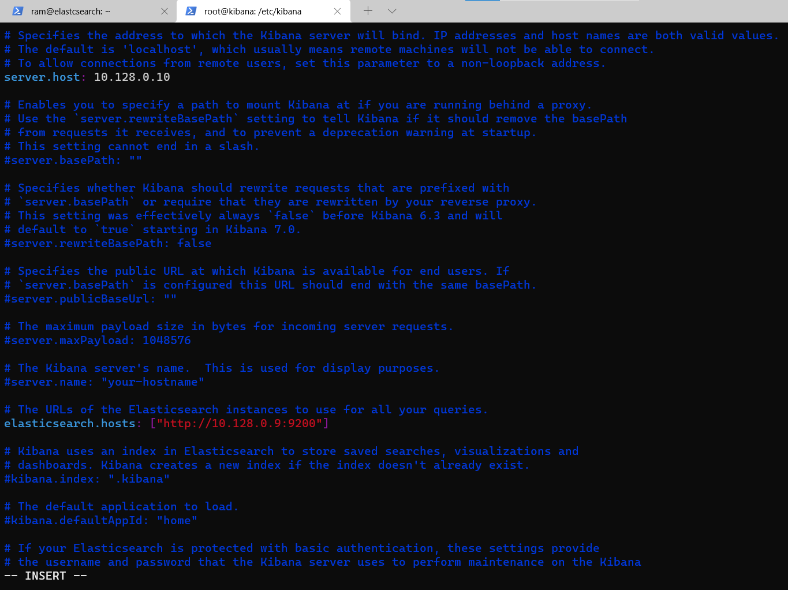

## Install and Configure Kibana

```
wget -qO - https://artifacts.elastic.co/GPG-KEY-elasticsearch | sudo apt-key add -

sudo apt-get install apt-transport-https

echo "deb https://artifacts.elastic.co/packages/7.x/apt stable main" | sudo tee -a /etc/apt/sources.list.d/elastic-7.x.list


sudo apt-get update && sudo apt-get install kibana -y

```
### nano /etc/kibana/kibana.yml 
* Change the following lines:



```
server.host: "your-server-ip"
elasticsearch.hosts: ["http://localhost:9200"]

```
* Save and close the file then start the Kibana service and enable it to start at system reboot
```
sudo systemctl start kibana.service
systemctl enable kibana.service

```


