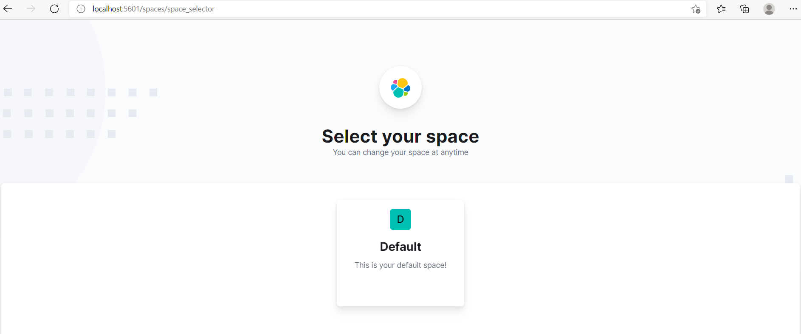

##  ELK stack configuration

* All these three tools are based on JVM and before start installing them, please verify that JDK has been properly configured. Check that standard JDK 1.8 installation, JAVA_HOME and PATH set up is already done

## Java Installtion and Path Setup :

```bash 
#!/bin/bash
# Shell script for installing Java in Ubuntu EC2 instance

# Command for installing Java 11
sudo apt-get update
sudo apt install openjdk-8-jdk openjdk-8-jre -y
sudo cat >> /etc/environment <<EOL
JAVA_HOME=/usr/lib/jvm/java-8-openjdk-amd64
JRE_HOME=/usr/lib/jvm/java-8-openjdk-amd64/jre
EOL

# cat | sudo tee -a /etc/environment <<EOL
# JAVA_HOME=/usr/lib/jvm/java-8-openjdk-amd64
# JRE_HOME=/usr/lib/jvm/java-8-openjdk-amd64/jre
# EOL

```

# elasticsearch Instation 
```bash
#!/bin/bash
sudo apt-get update -y
sudo apt-get install openjdk-11-jdk wget apt-transport-https curl gnupg2 -y
wget -qO - https://artifacts.elastic.co/GPG-KEY-elasticsearch | apt-key add - 
echo "deb https://artifacts.elastic.co/packages/7.x/apt stable main" | tee -a /etc/apt/sources.list.d/elastic-7.x.list
apt-get update -y
apt-get install elasticsearch -y
systemctl start elasticsearch
systemctl enable elasticsearch 
ss -antpl | grep 9200
# curl -X GET http://localhost:9200
```


# Logstach Installation 
```
sudo apt-get update -y
sudo apt-get install logstash -y
```
### configuration 
### nano /etc/logstash/conf.d/logstash.conf
```
#Specify listening port for incoming logs from the beats

input {
  beats {
    port => 5044
  }
}

# Used to parse syslog messages and send it to Elasticsearch for storing

filter {
  if [type] == "syslog" {
     grok {
        match => { "message" => "%{SYSLOGLINE}" }
  }
     date {
        match => [ "timestamp", "MMM  d HH:mm:ss", "MMM dd HH:mm:ss" ]
     }
  }
}

# Specify an Elastisearch instance

output {
  elasticsearch {
    hosts => ["localhost:9200"]
    index => "%{[@metadata][beat]}-%{+YYYY.MM.dd}"
  }
}
```
```
systemctl start logstash
systemctl enable logstash
```


## Install and Configure Kibana

```
sudo apt-get install kibana -y
```
### nano /etc/kibana/kibana.yml 
* Change the following lines:
```
server.host: "your-server-ip"
elasticsearch.hosts: ["http://localhost:9200"]

```
* Save and close the file then start the Kibana service and enable it to start at system reboot
```
systemctl start kibana
systemctl enable kibana
```



# Install and Configure Filebeat
* Filebeat is used to send logs to the Logstash or Elasticsearch for parsing. In this section, we will install the Filebeat and configure it to send logs to the Logstash.

```
sudo apt-get install filebeat -y
```
* Once installed, edit the Filebeat main configuration file and configure it to send logs to the Logstash.

### sudo nano /etc/filebeat/filebeat.yml
```
#output.elasticsearch:
  # Array of hosts to connect to.
#  hosts: ["localhost:9200"]
Comment out the following lines:

#output.elasticsearch:
  # Array of hosts to connect to.
#  hosts: ["localhost:9200"]

# Uncomment the following lines:

output.logstash:
hosts: ["localhost:5044"]
```
### Restart service 
```
systemctl start filebeat
systemctl enable filebeat
```

### Next, enable the Filebeat system module, which will examine local system logs:
``` 
filebeat modules enable system 
```
### Next, load the index template with the following command:
```
filebeat setup --index-management -E output.logstash.enabled=false -E 'output.elasticsearch.hosts=["localhost:9200"]'

```
### Verify 
```curl -XGET http://localhost:9200/_cat/indices?v```


