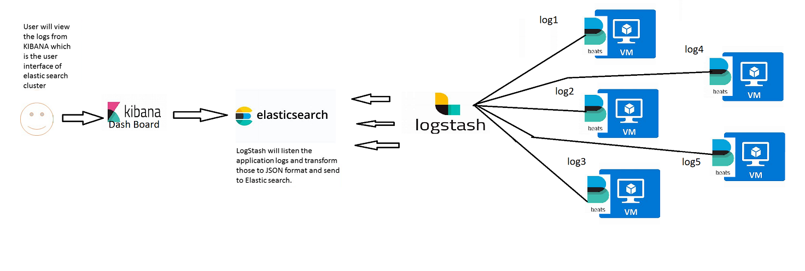
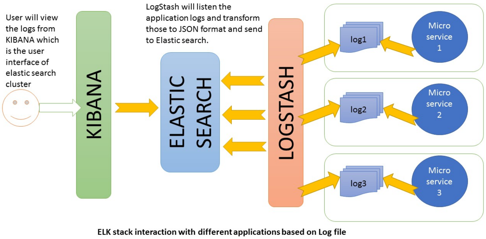

# ELK Stack
## One such popular set of tools are Elastic Search, Logstash and Kibana – together referred as ELK stack


## Elasticsearch
* Elasticsearch is a distributed, JSON-based search and analytics engine designed for horizontal scalability, maximum reliability, and easy management.

## Logstash
* Logstash is a dynamic data collection pipeline with an extensible plugin ecosystem and strong Elasticsearch synergy.

## Kibana
* Kibana gives the visualization of data through a UI.

#  ELK Stack Architecture

* Logstash processes the application log files based on the filter criteria we set and sends those logs to Elasticsearch. Through Kibana, we view and analyze those logs when required

## VM based :


## Application Based:


## [ ```Click Here for Installation steps``` ](Installation/Readme.md) 

## Advantages and Disadvantages of ELK stack
### Advantages
* ELK works best when logs from various Apps of an enterprise converge into a single ELK instance
* It provides amazing insights for this single instance and also eliminates the need to log into hundred different log data sources
* Rapid on-premise installation
* Easy to deploy Scales vertically and horizontally
* Elastic offers a host of language clients which includes Ruby. Python. PHP, Perl, .NET, Java, and JavaScript, and more
* Availability of libraries for different programming and scripting languages
### Disadvantages
* Different components In the stack can become difficult to handle when you move on to complex setup
* There’s nothing like trial and error. Thus, the more you do, the more you learn along the way

## will be contionous....